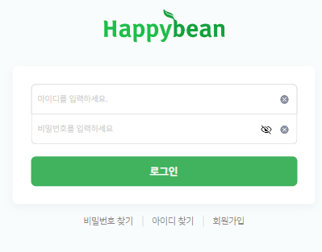

# Happy Bean Donation Site ☘️  
공익 기부 프로젝트를 위한 웹사이트  


<br><br>  


## 1. Project Overview (프로젝트 개요)  


- **프로젝트 이름**: 해피빈 기부 사이트  


- **프로젝트 설명**: 공익 기부 프로젝트를 위한 웹사이트  


<br><br>  


## 2. Tasks & Responsibilities (작업 및 역할 분담)

### 🌞 이예림
- **UI**:
  - 기부 페이지, 기부 관리자 페이지, 공지사항 메인 페이지, 펀딩 결제 페이지
- **기능**:
  - 기부 목록 조회, 기부 등록 및 관리, 모금함 상세페이지 DB연동

### 🧸 김혜진
- **UI**:
  - 메인 페이지, 펀딩 페이지, 캠페인 페이지, 로그인 및 회원가입 페이지
- **기능**:
  - 펀딩 및 캠페인 목록 조회, 펀딩 및 캠페인 등록 및 관리

### ❄️ 한치영
- **UI**:
  - 모금함 페이지
- **기능**:
  - 기부 및 펀딩 결제 프로세스 구현, 로그인 및 회원가입 기능, 사용자 인증

### 👻 장태욱
- **UI**:
  - 공지사항 상세 페이지, 공지사항 관리자 페이지
- **기능**:
  - 공지사항 작성 및 관리 기능, 공지사항 수정 및 삭제


<br><br>  


## 3. Development Period (개발 기간)

### 개발 기간
- 전체 개발 기간: 2024-09-06 ~ 2024-10-05
- UI 구현: 2024-09-06 ~ 2022-09-15
- 기능 구현: 2022-09-16 ~ 2022-10-05


<br><br>  


## 3. Key Features (주요 기능)

### 1. 사용자 관리 기능:

- **회원가입 및 로그인**:
  - 사용자는 사이트에 가입하고, 로그인 후 개인화된 서비스를 이용할 수 있습니다.

- **나의 정보 확인**:
  - 사용자는 자신의 보유 금액, 후원한 금액, 그리고 참여 내역을 확인할 수 있습니다.


### 2. 기부 및 펀딩 프로젝트 탐색 및 참여:

- **아이템 탐색**:
  - 진행 중인 기부 및 펀딩 프로젝트 목록을 확인하고, 각 프로젝트의 상세 정보를 볼 수 있습니다.

- **기부 및 펀딩 진행**:
  - 사용자는 원하는 기부 또는 펀딩 프로젝트에 기부를 진행할 수 있으며, 결제를 통해 참여할 수 있습니다.


### 3. 관리자 기능:

- **아이템 관리**:
  - 관리자는 진행중이거나 종료된 각 프로젝트 목록을 볼 수 있습니다.
    
  - 관리자는 새로운 기부, 펀딩, 캠페인, 공지사항을 생성하고, 수정하거나 삭제할 수 있습니다.
 

### 4. 시각적 정보 제공:

- **기부 및 펀딩 현황 및 진행률 확인**:
  - 기부 프로젝트의 모금 현황과 진행 상황을 시각적으로 확인할 수 있습니다.

- **자동 프로젝트 종료**:
  - 기부 프로젝트는 목표 금액이 달성되면 자동으로 종료되며, 펀딩 프로젝트는 설정된 기간이 끝나면 자동으로 종료됩니다.


<br><br>


## 5. Project Structure (프로젝트 구조)

```
Happypotato/
├── src/
│   ├── main/
│   │   ├── java/
│   │   │   ├── board/          # 게시판 관련 Java 클래스
│   │   │   ├── Controls/       # 펀딩, 캠페인 관련 Java 클래스
│   │   │   ├── donation/       # 기부 관련 Java 클래스
│   │   │   └── join/           # 회원가입 관련 Java 클래스
│   │   ├── webapp/
│   │       ├── admin/          # 관리자 페이지 관련 파일
│   │       ├── css/            # 스타일시트 파일 (CSS)
│   │       ├── font/           # 폰트 파일
│   │       ├── images/         # 이미지 파일들
│   │       ├── join/           # 회원가입 관련 파일
│   │       ├── js/             # JavaScript 파일들
│   │       ├── my/             # 사용자 관련 파일
│   │       ├── payment/        # 결제 관련 JSP 파일
│   │       ├── sql/            # SQL 쿼리 파일
│   │       ├── sub/            # 서브 페이지 관련 JSP 파일
│   │       │   ├── campaign/   # 캠페인 관련 파일
│   │       │   ├── donation/   # 기부 관련 파일
│   │       │   ├── funding/    # 펀딩 관련 파일
│   │       │   ├── fundrasing/ # 모금함 관련 파일
│   │       │   └── notice/     # 공지사항 관련 파일
│   │       ├── views/          # 여러 페이지에서 공통으로 사용되는 템플릿 파일
│   │       ├── WEB-INF/        # 웹 애플리케이션의 설정 및 보안 파일들
│   │       └── index.jsp       # 메인 페이지 파일
└── README.md                   # 프로젝트 설명 파일

```


<br><br>

## 6. Tech Stack (기술 스택)

### Frontend


### Backend


### Tools


<br><br>

## 7. Site introduction (사이트 소개)
<br>

### 7-1. Default page (기본 페이지)

| **페이지**            | **설명**                                                                                                                         | **이미지**                             |
|-----------------------|----------------------------------------------------------------------------------------------------------------------------------|----------------------------------------|
| **Main Page**         | 전체 사이트의 대표 페이지로, 사용자에게 기부, 모금함, 펀딩, 캠페인, 공지사항 등의 정보를 한 눈에 제공합니다. 추천 기부 프로젝트 및 펀딩 항목들을 시각적으로 표시하여 쉽게 접근할 수 있게 합니다. |        |
| **Donation Page**     | 기부와 관련된 모든 프로젝트를 탐색하고 기부할 수 있는 페이지입니다. 현재 진행 중인 기부의 상태와 목표 금액, 모금 금액 등의 정보를 제공하며, 종료된 프로젝트에 대한 기록도 확인할 수 있습니다. | |
| **Fundraising Page**  | 모금함과 관련된 프로젝트 목록을 확인할 수 있으며, 사용자는 해당 프로젝트에 기부하고 참여할 수 있습니다.                           | |
| **Funding Page**      | 펀딩과 관련된 프로젝트를 확인하고 참여할 수 있는 페이지입니다. 각 프로젝트의 목표 금액과 현재 진행 상황 등을 시각적으로 확인할 수 있습니다. |   |
| **Campaign Page**     | 사회 공헌과 관련된 다양한 캠페인을 소개하는 페이지입니다. CSR 및 사회 공헌과 관련된 정보를 전달합니다.                              | |
| **Notice Page**       | 사용자와 관리자에게 중요한 공지사항을 확인할 수 있는 페이지입니다. 새로운 공지사항을 확인하고 필요한 정보를 빠르게 얻을 수 있습니다. |     |


<br>


### 7-2. Log in & Sign up (로그인 및 회원가입)

| **페이지**   | **설명**                                                                 | **이미지**                          |
|--------------|------------------------------------------------------------------------|-------------------------------------|
| **Log in**   | 사용자가 기존 계정으로 사이트에 로그인하여 개인화된 서비스에 접근할 수 있는 페이지입니다.  |   |
| **Sign up**  | 새로운 사용자가 계정을 생성하여 사이트의 모든 서비스에 접근할 수 있도록 돕는 페이지입니다. |   |


<br>

### 7-3. End donation sign (기부 종료 표시 방법)

| 상태                        | 설명                                                               | 예시 이미지                               |
|-----------------------------|--------------------------------------------------------------------|-------------------------------------------|
| **종료 팝업**               | 기부가 목표 금액에 도달하면 팝업을 통해 캠페인이 성공적으로 종료되었음을 알립니다. 사용자는 다른 후원 기회를 탐색하도록 안내받습니다. |    |
| **기부 아이템 - 종료**      | 특정 기부 아이템 카드에는 "종료" 오버레이가 표시되며, 진행률 바가 "100%"로 나타납니다. 이를 통해 사용자는 완료된 캠페인을 쉽게 식별할 수 있습니다. |  |
| **모금함 아이템 - 종료**    | 가부 아이템 종료와 같이 목표에 도달하면 "종료" 오버레이가 표시되어 프로젝트가 성공적으로 완료되었음을 나타냅니다. |  |


